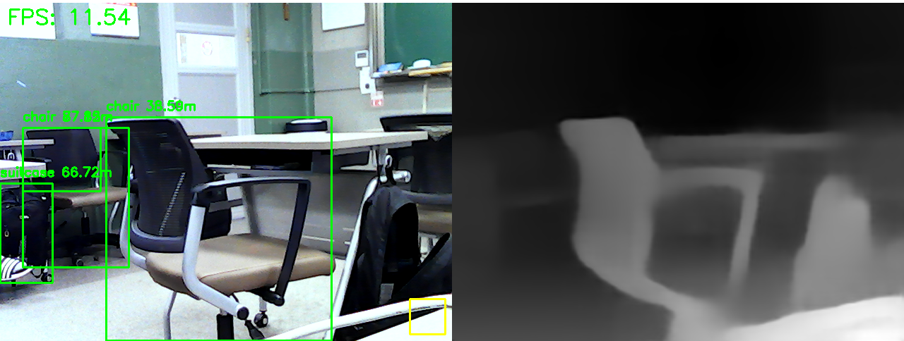
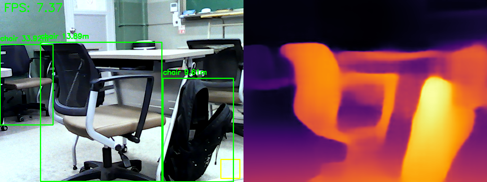

# Mono-depth-Midas-to-Real-depth
This repository contains code to convert relative depth map to real depth map with [MiDaS](https://github.com/isl-org/MiDaS) and [YOLO](https://github.com/ultralytics/ultralytics)
___
## Feature of MiDaS
MiDaS deep learning model compute depth form a single image. But this model output only relative depth. because, stereo camera usesing different parallax like our eyes, but MiDaS only using single image.

So it can create **relative depth** map.

But I make this repository to overcome limits *(generate real depth)*
___
## Convert program pipline

1. get video from cv2
2. input YOLO & MiDaS
3. make bounding box & depth map form cam frame
4. compare average depth in **standard box**  with average depth in object detected **bounding box**
5. calcuate real depth(standard box real depth entered)

___
## Code
*detail of code refer to comment I'll note here about cautions*

1. ```py
    # set base depth (input real depth in bottom right yello box)
    REF_REAL_M = 15.0
    ```
you can set this num and reversion if you want

2. ```py
    with torch.no_grad():
        fps = 1
        video = VideoStream(0).start()
        time_start = time.time()
        ...
    ```
This code using a usb camera for video input, `VideoStream(0)` you can select cam by list of connected camera.

3. If you want to change model here
```py
    yolo_model = YOLO("yolo11n.pt")
```
Yolo
```py
def run(input_path, output_path, model_path, model_type="dpt_levit_224", optimize=False, height=None):
    print("Initialize")
```
```py
    parser.add_argument('-t', '--model_type', default='dpt_levit_224')
```
Midas

4. 
```py
 if optimize and device == torch.device("cuda"):
```
```py
device = torch.device("cuda" if torch.cuda.is_available() else "cpu")
```
If you don't want using CUDA(enhance processing with GPU), changing `cuda` to `cpu`

5.
If you want to change color type of Midas
```py
combined = np.hstack((yolo_annotated, create_side_by_side(None, prediction, True)))
```
chage `True` and `False`
because of here
```py
def create_side_by_side(image, depth, grayscale):
```


___
## Example

Midas v3.1 dpt_levit_224 

Midas v3.1 dpt_swin2_large_384

**We can find something intresting points.**
**Top(levit_224) vs Bottom(Large 384)**
1. Yello base box(bottom right on Yolo)
- Between camera and standing lectur desk distance is similer.
- But distingishing point is base box avarage of depth 
- Base box is contained 15m real distance fixed. But Top and Buttom isn't correct about average of depth.
- So a student behind lectur dex (he is wearing black shirt) considerable difference of depth between two picture.
2. Midas model considerable diffenrce at detail. This envirment is laptop Galaxy Book Flex2 (i7-1165G7, MX450)
- dpt_levit_224 is low quility output but can realtime feedback. This situation laptop performance limited because of overheat, but condittion is more better average FPS is 17.
- dpt_large_384 is high quality but taks many culcuation. So FPS is low
